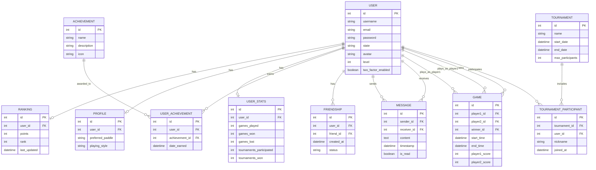

# ft_transcendence

###  Project Structure

```
ft_transcendence/
├── services/                              # Directory for all microservices
│   ├── auth/                              # User management and authentication service
│   │   ├── Dockerfile
│   │   ├── requirements.txt
│   │   ├── manage.py
│   │   ├── auth/                         # Django app for authentication
│   │   └── ...
│   ├── users/                             # User profiles and management service
│   │   ├── Dockerfile
│   │   ├── requirements.txt
│   │   ├── manage.py
│   │   ├── users/                        # Django app for user profiles
│   │   └── ...
│   ├── game/                              # Game logic and matchmaking service
│   │   ├── Dockerfile
│   │   ├── requirements.txt
│   │   ├── manage.py
│   │   ├── game/                         # Django app for game logic
│   │   └── ...
│   ├── tournament/                       # Tournament management service
│   │   ├── Dockerfile
│   │   ├── requirements.txt
│   │   ├── manage.py
│   │   ├── tournament/                   # Django app for tournaments
│   │   └── ...
│   ├── settings/                         # Service for managing application settings
│   │   ├── Dockerfile
│   │   ├── requirements.txt
│   │   ├── manage.py
│   │   ├── settings/                     # Django app for settings
│   │   └── ...
│   ├── stats/                            # Service for user and game statistics
│   │   ├── Dockerfile
│   │   ├── requirements.txt
│   │   ├── manage.py
│   │   ├── stats/                        # Django app for statistics
│   │   └── ...
│   ├── frontend/                         # Next.js frontend application
│   │   ├── Dockerfile
│   │   ├── package.json
│   │   ├── next.config.js
│   │   └── ...
│   ├── elk/                              # ELK stack configuration
│   │   ├── docker-compose.yml
│   │   ├── elasticsearch/
│   │   ├── logstash/
│   │   └── kibana/
│   ├── monitoring/                       # Monitoring system configuration
│   │   ├── docker-compose.yml
│   │   ├── prometheus/
│   │   └── grafana/
├── docker-compose.yml                    # Compose file for all services
├── .env                                  # Environment variables
│
├── frontend/
│   ├── public/
│   ├── src/
│   ├── package.json
│   └── Dockerfile
│
├── database/
│   ├── init.sql
│   └── Dockerfile
│
├── nginx/
│   ├── nginx.conf
│   └── Dockerfile
└── README.md
```

### Key Points

1. **Microservices**:
   - Each microservice (e.g., `authentication`, `tournaments`, `game`, `stats`, `remote`) is isolated in its own directory with a clear responsibility.
   - Each service has its own `Dockerfile`, `requirements.txt`, and Django app structure (`views.py`, `models.py`, etc.).

2. **Common Components**:
   - Shared logic, utilities, and base models or views are housed in the `common` directory to promote DRY (Don't Repeat Yourself) principles.
  




4. **API Gateway**:
   - The `api_gateway` service serves as the entry point, routing requests to the appropriate microservices and potentially handling cross-cutting concerns like authentication and rate limiting.

5. **Communication**:
   - Microservices communicate via RESTful APIs. For more advanced use cases, you might consider adding message queues (e.g., RabbitMQ, Kafka) for asynchronous communication.
